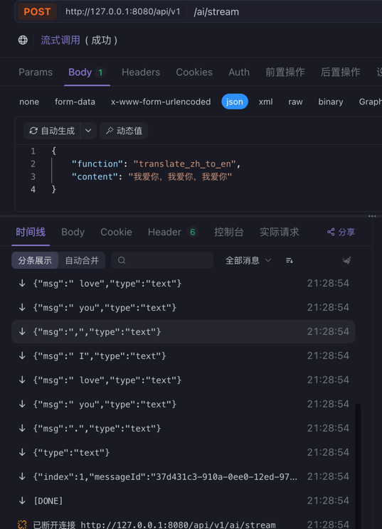

# AI Backend 项目文档

这是一个基于 Gin 框架构建的简单 AI 后端服务项目，集成了豆包大模型 API，提供文本翻译、总结等 AI 功能。

## 环境变量配置

在启动项目前，需要设置以下环境变量：

```bash
export ARK_API_KEY="xxxxxxx"
```


其中 `ARK_API_KEY` 是豆包平台的 API 密钥。（申请的豆包免费额度，可以放心使用，密钥在文第二题压缩包的ARK_API_KEY中获取）

## 项目启动步骤

1. 克隆项目到本地：
   ```bash
   git clone <项目地址>
   cd ai-backend
   ```


2. 设置环境变量：
   ```bash
   export ARK_API_KEY="xxxxxxx"
   ```


3. 安装依赖：
   ```bash
   go mod tidy
   ```


4. 编译项目：
   ```bash
   go build -o ai-backend
   ```


5. 启动服务：
   ```bash
   go run main.go
   ```


默认监听端口为 8080，可通过配置文件修改。

## 项目功能

本项目提供了以下 AI 功能：

### 1. 文本翻译
- 中文翻译成英文 (translate_zh_to_en)
- 英文翻译成中文 (translate_en_to_zh)

### 2. 文本总结
- 对输入文本进行核心观点总结 (summarize)

### 3. 调用方式
项目提供三种调用方式：
- 同步调用：直接返回结果
- 异步任务：提交任务后通过任务ID查询结果
- 流式调用：实时返回AI生成的内容

### 4. API 接口列表

| 接口 | 方法 | 路径 | 描述 |
|------|------|------|------|
| 获取功能列表 | GET | `/api/v1/functions` | 获取所有支持的AI功能列表 |
| 同步调用 | POST | `/api/v1/ai/call` | 同步调用AI功能 |
| 提交异步任务 | POST | `/api/v1/ai/task` | 提交AI处理任务 |
| 查询任务结果 | GET | `/api/v1/ai/task/:taskId` | 根据任务ID查询处理结果 |
| 流式调用 | POST | `/api/v1/ai/stream` | 流式调用AI功能 |

## 功能详情

### 获取功能列表
- 请求方法：GET
- 请求路径：`/api/v1/functions`
- 响应示例：
```json
{
  "code": 0,
  "message": "success",
  "data": [
    {
      "name": "translate_zh_to_en",
      "description": "中文翻译成英文"
    },
    {
      "name": "translate_en_to_zh",
      "description": "英文翻译成中文"
    },
    {
      "name": "summarize",
      "description": "文本总结"
    }
  ]
}
```
### apiFix地址（有所有接口）
- 高朋举 在 Apifox 邀请你加入项目 ai-backend https://app.apifox.com/invite/project?token=aTF1Cg9h-HWRWeNb8zdg1

### 同步调用
- 请求方法：POST
- 请求路径：`/api/v1/ai/call`
- 请求参数：
```json
{
  "function": "translate_zh_to_en",
  "content": "你好，世界"
}
```


### 异步任务
- 提交任务：
    - 请求方法：POST
    - 请求路径：`/api/v1/ai/task`
    - 请求参数：
  ```json
  {
    "function": "summarize",
    "content": "很长的文章内容..."
  }
  ```


- 查询结果：
    - 请求方法：GET
    - 请求路径：`/api/v1/ai/task/:taskId`
    - 响应示例：
  ```json
  {
    "code": 0,
    "message": "success",
    "data": {
      "task_id": "任务ID",
      "status": "completed",
      "function": "summarize",
      "result": "文章总结内容",
      "created_at": "2023-01-01T00:00:00Z",
      "updated_at": "2023-01-01T00:00:01Z"
    }
  }
  ```


### 流式调用
- 请求方法：POST
- 请求路径：`/api/v1/ai/stream`
- 请求参数：
```json
{
  "function": "translate_en_to_zh",
  "content": "Hello, world"
}
```

- 响应格式：使用 Server-Sent Events (SSE) 实时返回结果
- 


## 技术架构

- Web 框架：Gin
- AI 服务：豆包大模型
- 配置管理：Viper
- 任务管理：内存存储 + 协程处理
- 跨域支持：gin-contrib/cors

## 注意事项

1. 项目使用内存存储任务信息，重启服务会丢失所有任务数据
2. 项目默认每10分钟清理一次过期任务
3. 流式调用使用 SSE 技术实现实时返回
4. 所有接口返回统一的 JSON 格式